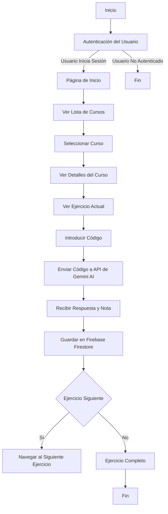

# TFG DAW
 
# Diagrama de Flujo del Proyecto

```mermaid
graph TD
A[Inicio] --> B[Autenticación del Usuario]
B -->|Usuario Inicia Sesión| C[Página de Inicio]
B -->|Usuario No Autenticado| D[Fin]
C --> E[Ver Lista de Cursos]
E --> F[Seleccionar Curso]
F --> G[Ver Detalles del Curso]
G --> H[Ver Ejercicio Actual]
H --> I[Introducir Código]
I --> J[Enviar Código a API de Gemini AI]
J --> K[Recibir Respuesta y Nota]
K --> L[Guardar en Firebase Firestore]
L --> M{Ejercicio Siguiente}
M -->|Sí| N[Navegar al Siguiente Ejercicio]
M -->|No| O[Ejercicio Completo]
O --> P[Fin]
```
